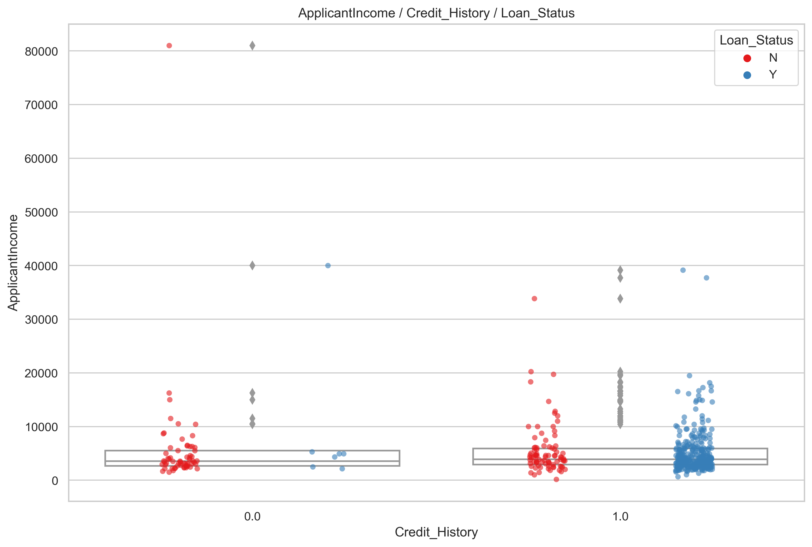
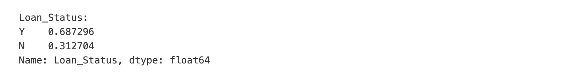
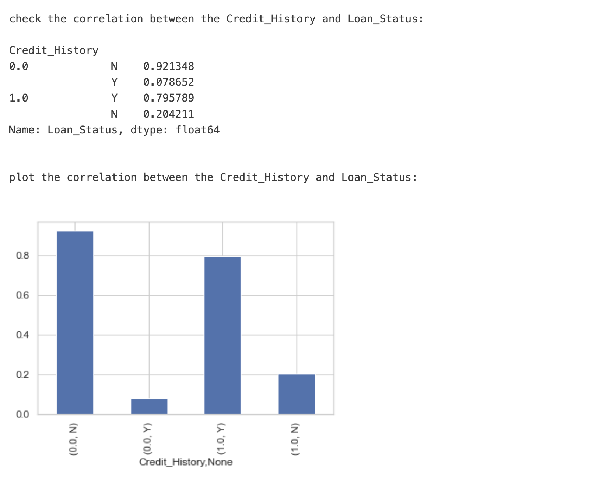
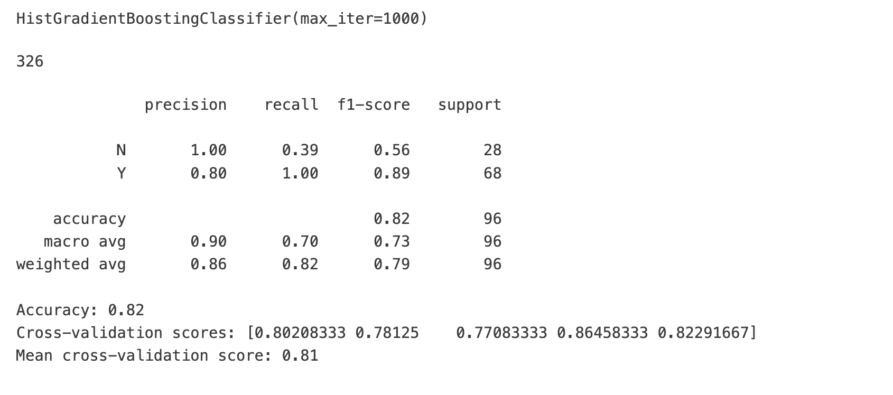
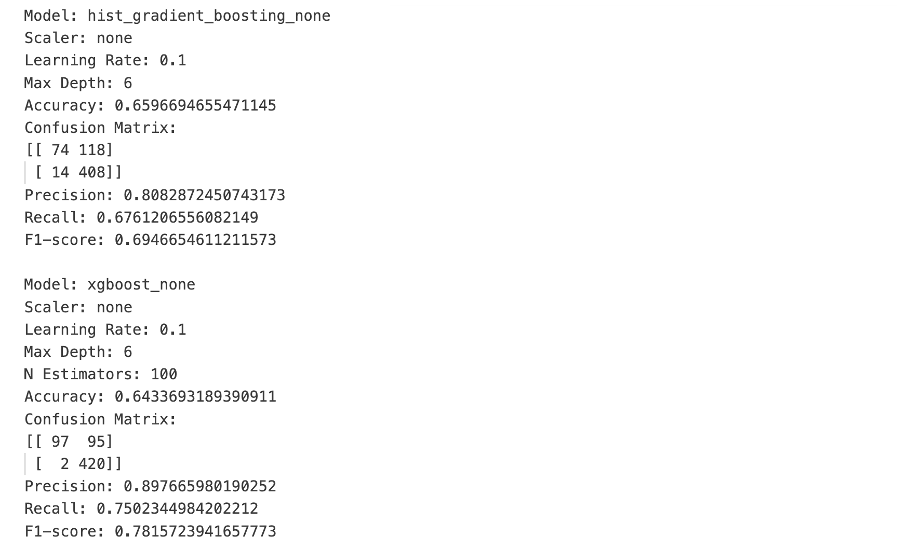
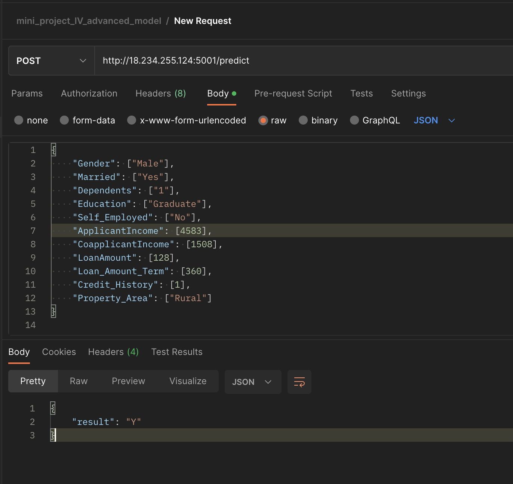

# Mini-project IV

### [Assignment](assignment.md)

## Project/Goals
The project aims to predict loan approval status using machine learning models. The objective is to develop a model that can accurately predict whether a loan applicant will be approved or not based on their profile information. The final model will be deployed using Flask and hosted on AWS.

## Hypothesis
I hypothesize that applicants with higher income, good credit history, and lower loan amounts will be more likely to have their loans approved. To test this hypothesis, I will evaluate the relationships between these features and loan approval status in the data, and include these features in the predictive models.

## EDA 
During the exploratory data analysis, I found that features such as credit history, income, and loan amount are indeed related to loan approval status. Other features like property area, education, and employment status also showed some relationship with the target variable.





In the Exploratory Data Analysis (EDA) process, I identified two baseline accuracies. The first one is the proportion of 'Y' and 'N' values in the Loan_Status column, which indicates the overall approval and rejection rates of loan applications. This baseline provides a general understanding of the dataset's balance and the potential challenges that may arise when training a machine learning model.





The second baseline accuracy is based on using the Credit_History as a single predictor for loan rejection. Specifically, I consider all applicants with 'N' in their credit history as being denied a loan. This approach allows us to establish a simple, yet informative benchmark for our predictive models. By comparing the performance of more complex models to these baselines, I can gauge their effectiveness and ensure that they provide meaningful insights beyond what can be derived from these basic metrics.

 


In our training process, I used only the Credit_History as the independent variable with the HistGradientBoostingClassifier algorithm. The classifier was set to have a maximum of 1000 iterations, and the results were as follows:

The overall accuracy of the model was 0.82, which indicates that it correctly predicted 82% of the loan applications in the test dataset.

The precision, recall, and F1-score for the 'N' (loan rejection) class were 1.00, 0.39, and 0.56, respectively. This shows that the model perfectly identified all true negatives, but it had a lower recall, meaning that it missed some of the actual rejections.
For the 'Y' (loan approval) class, the precision, recall, and F1-score were 0.80, 1.00, and 0.89, respectively. This indicates that the model performed well in identifying true positives, but it had a lower precision, which means that it incorrectly classified some of the negative cases as positive.

Additionally, I conducted a 5-fold cross-validation to further assess the model's performance. The cross-validation scores were [0.80208333, 0.78125, 0.77083333, 0.86458333, 0.82291667], with a mean score of 0.81. This indicates that the model's performance was consistent across different data splits, and it can be considered a reliable benchmark for further analysis and comparison with more complex models.




## Process
1. EDA: Explored the dataset, visualized feature relationships, and identified important features.
2. Data Cleaning: Handled missing values, outliers, and encoded categorical variables.
3. Feature Engineering: Created new features and transformed existing ones to improve model performance.
4. Modeling: Trained HistGradientBoostingClassifier and XGBoost models using various hyperparameters and evaluated their performance.
5. Deployment: Deployed the best model using Flask and hosted the API on AWS.

### EDA
During EDA, I examined the relationships between different features and the loan approval status. I found that credit history, applicant income, and loan amount had significant impacts on the loan approval decision.

### Data Cleaning
I cleaned the dataset by handling missing values, removing outliers, and encoding categorical variables. I also standardized the numerical features to improve model performance.

### Feature Engineering
I created new features like the debt-to-income ratio and transformed existing features to improve model performance.


| Feature Engineering Step                         | Description                                                                                                                                                                                                                                      |
| ------------------------------------------------ | ------------------------------------------------------------------------------------------------------------------------------------------------------------------------------------------------------------------------------------------------ |
| Convert data types                               | Convert numerical columns to `float` and categorical columns to `category` data type.                                                                                                                                                            |
| Log transform LoanAmount                         | Multiply `LoanAmount` by 1000 and apply a log transformation: $log(LoanAmount \times 1000)$.                                                                                                                                                     |
| Loan_Status_number                               | Map `Loan_Status` to numerical values: 'Y' -> 1, 'N' -> 0 (only for the train dataset).                                                                                                                                                           |
| Fill missing Married values and map to numbers   | Map 'Yes' -> 2, 'No' -> 1 for the `Married` column, and fill missing values with 1.                                                                                                                                                              |
| Calculate TotalIncome and log transform          | Add `ApplicantIncome` and `CoapplicantIncome` to get `TotalIncome`, and apply a log transformation: $log(ApplicantIncome + CoapplicantIncome)$.                                                                                                   |
| Fill missing Dependents values and map to numbers| Map '0' -> 0, '1' -> 1, '2' -> 2, '3+' -> 3 for the `Dependents` column, and fill missing values with 0.                                                                                                                                           |
| Calculate family_size                            | Add `Dependents_number` and `Married_number` to get `family_size`: $(Dependents\_number + Married\_number)$.                                                                                                                                      |
| Calculate income_per_person                      | Divide `TotalIncome` by `family_size` to get `income_per_person`: $\frac{TotalIncome}{family\_size}$.                                                                                                                                            |
| Calculate income_share                           | Divide `CoapplicantIncome` by `ApplicantIncome` to get `income_share`: $\frac{CoapplicantIncome}{ApplicantIncome}$.                                                                                                                             |
| Calculate LoanAmount_monthly                     | Divide `LoanAmount` by `Loan_Amount_Term` to get `LoanAmount_monthly`: $\frac{LoanAmount}{Loan\_Amount\_Term}$.                                                                                                                                 |
| Calculate LoanAmount_monthly_to_income           | Divide `LoanAmount_monthly` by `TotalIncome` to get `LoanAmount_monthly_to_income`: $\frac{LoanAmount\_monthly}{TotalIncome}$.                                                                                                                   |
| Calculate LoanAmount_monthly_per_person          | Divide `LoanAmount_monthly` by `family_size` to get `LoanAmount_monthly_per_person`: $\frac{LoanAmount\_monthly}{family\_size}$.                                                                                                                |
| Create lookup_tables for categorical columns     | Group the data by each categorical column and calculate the mean and count of `Loan_Status_number` for each group (only for the train dataset).                                                                                                   |
| Merge lookup_tables to the main DataFrame        | Merge each categorical column's lookup_table to the main DataFrame and drop the original categorical columns.                                                                                                                                     |
| Drop unnecessary columns                         | Drop 'Loan_ID', 'Loan_Status_number', 'Dependents_number', and 'Married_number' columns.                                                                                                                                                         |


### Modeling
I trained HistGradientBoostingClassifier and XGBoost models using various hyperparameters and evaluated their performance. The best model was a HistGradientBoostingClassifier with no scaler, a learning rate of 0.1, and a max depth of 6. This model achieved an accuracy of 0.658.

| Metric/Model                       | HistGradientBoostingClassifier | GaussianNB         | XGBoost              |
|------------------------------------|--------------------------------|--------------------|----------------------|
| Log Transformer                   | Possibly Beneficial            | Possibly Beneficial| Possibly Beneficial  |
| Scaler (e.g., StandardScaler)     | Not Essential                  | Beneficial         | Not Essential        |
| PCA (Principal Component Analysis)| Not Essential                  | Not Essential      | Not Essential        |
| Feature Selection                 | Beneficial                     | Beneficial         | Beneficial           |
| Grid Search                        | Beneficial                     | Beneficial         | Beneficial           |
| Hyperparameter Tuning             | Beneficial                     | Beneficial         | Beneficial           |


| Task                     | Details                                                                                                                                                                                                                                                                                                        |
| ------------------------ | -------------------------------------------------------------------------------------------------------------------------------------------------------------------------------------------------------------------------------------------------------------------------------------------------------------- |
| Feature Selection        | `feature_engineering()` function is used to select features and create new ones based on the original dataset.                                                                                                                                                                                                 |
| Model Selection          | Two models are used for classification: `HistGradientBoostingClassifier` and `XGBClassifier`.                                                                                                                                                                                                                  |
| Scaler Selection         | Five different scalers are tested: 'none', 'standard', 'normalizer', 'minmax', and 'power'. However, for `HistGradientBoostingClassifier` and `XGBClassifier`, only 'none' scaler is adopted.                                                                                                              |
| Hyperparameter Tuning    | Grid search is performed using `GridSearchCV` on the following hyperparameters:<br> - HistGradientBoostingClassifier: `learning_rate` and `max_depth`.<br> - XGBClassifier: `learning_rate`, `max_depth`, and `n_estimators`.                                                                                  |
| Evaluation Metric        | 'accuracy' is used as the evaluation metric for the grid search.                                                                                                                                                                                                                                               |
| Cross-Validation         | 5-fold cross-validation is used in `GridSearchCV`.                                                                                                                                                                                                                                                             |
| Save Best Model          | The best model with the highest accuracy is saved to 'best_model.pkl' file for later use in deployment.                                                                                                                                                                                                        |
| Hyperparameter Tuning Report | A detailed report of hyperparameter tuning is saved to 'hyperparameter_tuning_report.txt' file, including model name, scaler, best hyperparameters, accuracy, confusion matrix, precision, recall, and F1-score for each combination. Additionally, a summary table is saved to 'hyperparameter_tuning_result_table.md'. |


### Deployment
I deployed the best model using Flask and hosted the API on AWS. This allows users to input applicant information and receive a loan approval prediction.

| Potential Deployment Overlooks           | Description                                                                                                                                                                                                                                                                   |
| --------------------------------------- | ----------------------------------------------------------------------------------------------------------------------------------------------------------------------------------------------------------------------------------------------------------------------------- |
| Inconsistent Library Versions           | Not using a `requirements.txt` file or not updating it to keep the library versions consistent between the development environment and the server. This can cause errors due to differences in the library functionality or compatibility issues.                            |
| Not Saving Preprocessing Objects        | Failing to save and use the same preprocessing objects (e.g., scalers, encoders, etc.) that were used during training. This can lead to inconsistencies in data preprocessing and affect the model's performance during deployment.                                       |
| Insufficient Testing on New Data        | Not testing the model on new, unseen data before deploying it, which can lead to unexpected behavior and poor performance in real-world scenarios.   

## Results/Demo




The best model achieved an accuracy of 0.660 with a precision of 0.808 and a recall of 0.676. The F1-score was 0.695. 


| Metric       | Formula                                               |
| ------------ | ----------------------------------------------------- | 
| Accuracy     | $\frac{TP + TN}{TP + TN + FP + FN}$                   |
| Precision    | $\frac{TP}{TP + FP}$                                   |
| Recall       | $\frac{TP}{TP + FN}$                                   |
| F1-score     | $2 \times \frac{Precision \times Recall}{Precision + Recall}$ |
| Baseline Accuracy | $\frac{\text{Number of Majority Class}}{\text{Total Number of Instances}}$ |

Our model couldn't surpass the baseline accuracies due to potential reasons like dataset limitations, insufficient feature engineering, model simplicity, and inadequate hyperparameter tuning. To improve performance, I can explore advanced algorithms, create new features, and fine-tune model parameters.


A live demo showcases the usage of Postman, a popular API testing tool, to send requests to our deployed API. The following JSON object represents an example input for the model, containing various loan applicant details:

```json
{
    "Gender": ["Male"],
    "Married": ["Yes"],
    "Dependents": ["1"],
    "Education": ["Graduate"],
    "Self_Employed": ["No"],
    "ApplicantIncome": [4583],
    "CoapplicantIncome": [1508],
    "LoanAmount": [128],
    "Loan_Amount_Term": [360],
    "Credit_History": [1],
    "Property_Area": ["Rural"]
}
```





## Challenges
During the project, I faced challenges in handling missing values, selecting the best features, and tuning the hyperparameters of the models. Balancing model complexity and performance was also challenging.

## Future Goals
If I had more time, I would explore other machine learning models and feature engineering techniques to improve the model's performance. Additionally, I would investigate potential biases in the dataset and assess the impact of these biases on the model's predictions.

